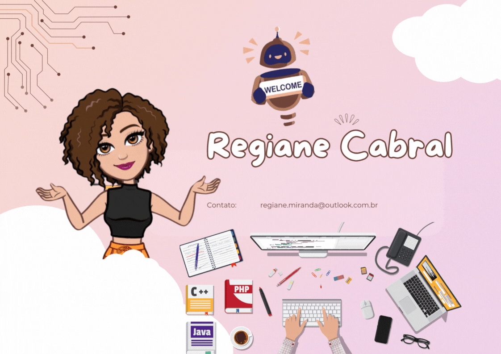

 

 ---

 
 
 

 
  
  
  
  
   
 

## 🚀 Sobre mim
🎓 Estudando **Ciência da Computação**  
🌱 Aprendendo constantemente e aberta a novos desafios  
🌏 Interesse pela **Cultura e Língua Chinesa**  
🎮 Fã de **Games** e entusiasta na criação de jogos  

---

## 🛠️ Ferramentas e Tecnologias

 
 **Que tenho conhecimento:**  
   
**Que estou aprendendo:**  
    
**Outros:**   APIs, Design Responsivo, Testes de Qualidade  

---

  <a href="https://github.com/giannycabral">
  
  

