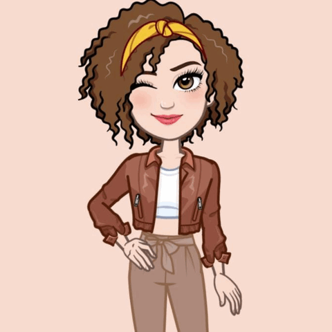

 
 

 <h1 align="center" style="font-size: 40">👋 Olá, eu sou a Regiane </h1>

 

 
 

 
  
  
  
  
   
 

### 💻Desenvolvedora em desenvolvimento

Tenho uma paixão por resolver problemas complexos e melhorar processos, especialmente na área de **Engenharia da Qualidade**. Estou explorando como a programação pode transformar a eficiência e a eficácia em diversos cenários.

---
## 🚀 Sobre mim
- 🎓 Estudando **Ciência da Computação**  
- 🌱 Aprendendo constantemente e aberta a novos desafios  
- 🌏 Interesse pela **Cultura e Língua Chinesa**  
- 🎮 Fã de **Games** e entusiasta na criação de jogos  

---

## 🛠️ Ferramentas e Tecnologias
- **Que tenho conhecimento:** 
- **Que estou aprendendo:**  
- **Outros:** APIs, Design Responsivo, Testes de Qualidade  

---
## 📊 Estatísticas

  

---

 

  
